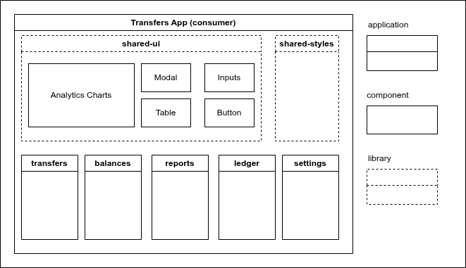

<h1 align="center">
<br>
  
<br>
<br>
Federated Transfers Demo App with Zaphyr, NX, Rspack and React  
</h1>
<h2 align="center" >Version 1.0</h2>

# Description

This repo features the usage of Zephyr, NxPack, NX and React in a project using module-federation for micro-frontends.

The example is basically a demo transfers app with different pages which can be independently deployed to zephyr cloud relying only on Zephyr’s default Cloud integration.

# Tools

- Rspack Zephyr Plugin  🚀 - 0.1.14
- NX ✈️ - 22.0.2
- React 🌐 - 19.0.0
- TypeScript 📘 - 5.9.3
- Bootstrap 💄 - 5.3.8


# Useful Commands

```bash
# create new shared library
npx nx g @nx/react:library libs/shared-ui --style=scss --bundler=none --js=false

# create new app
npx nx g @nx/react:app apps/ui-playground --bundler=rspack --style=scss --js=false

# create new host
npx nx g @nx/react:host apps/host-app --bundler=rspack --style=scss --js=false
# create new remote
npx nx g @nx/react:remote apps/remote-app --bundler=rspack --style=scss --js=false

#remove apps
npx nx g @nx/workspace:remove micro-app
```

# Issues

1. Imports from `shared-ui` don't work. 
```
'rootDir' is expected to contain all source files.ts(6059)
```
2. Aliases could be added to `scss` files for shorter import paths